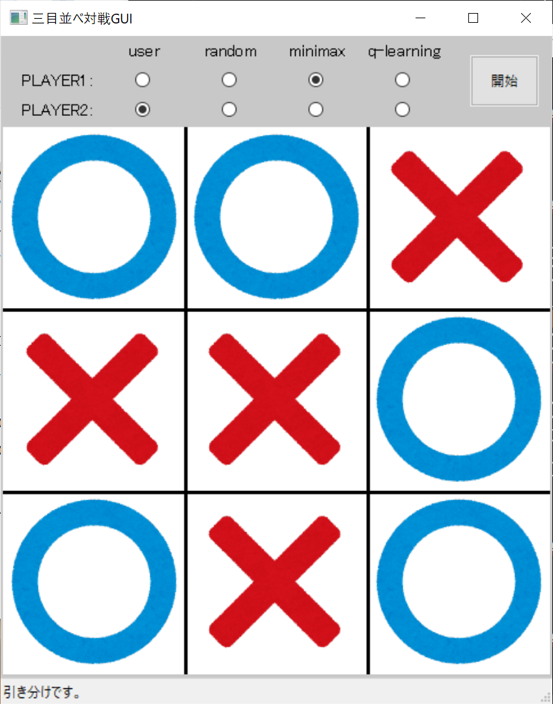

会社の勉強会で作成したQ学習とMiniMax法のコードをベースに対戦エージェントを作成し、それを使用した三目並べ対戦GUIを作成しました。 

ブログ記事はこちら↓ 
[Pythonで三目並べ対戦GUIを作ってみた](https://fallpoke-tech.hatenadiary.jp/entry/2024/08/17/223716) 

### 実行時のGUIイメージ

## MiniMax法
- minimax.py 
  MiniMax法で三目並べを実行する対戦エージェント。 

## Q学習
- training.py 
  学習スクリプト。config.iniでパラメータを設定し学習を実行します。 
  学習済みの重みは"weight_\[学習回数\].csv"という名前でweightsフォルダに格納されます。 
- q_learning.py 
  学習済みの重みを使用してQ学習で三目並べを実行する対戦エージェント。 
  config.iniで使用する学習済みの重みをそれぞれのプレイヤー分指定して使用します。 

### 更新履歴
- 20240816: ソースコード一式を追加 
  会社の勉強会で作成した対戦エージェントのソースコード。 
  GUIは"人vs人"のみ可能。 
- 20240817: 対戦エージェントを組み込み 
  "人vs対戦エージェント"、"対戦エージェントvs対戦エージェント"が可能 
