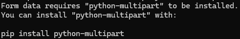

### FastAPIを使用したファイルダウンロードのAPIのサンプル  

### 記事
[準備中]()

#### 実行コマンド
以下、1,2どちらでも可能です。  
1. ```python main.py```
2. ```uvicorn main:app --reload```

#### 画面表示
実行後に下記にアクセス。  
[http://localhost:8000/](http://localhost:8000/)


### 注意点
事前に<b>python-multipart</b>のインストールが必要です。  
```pip install python-multipart```  
<実行時のエラー>  


